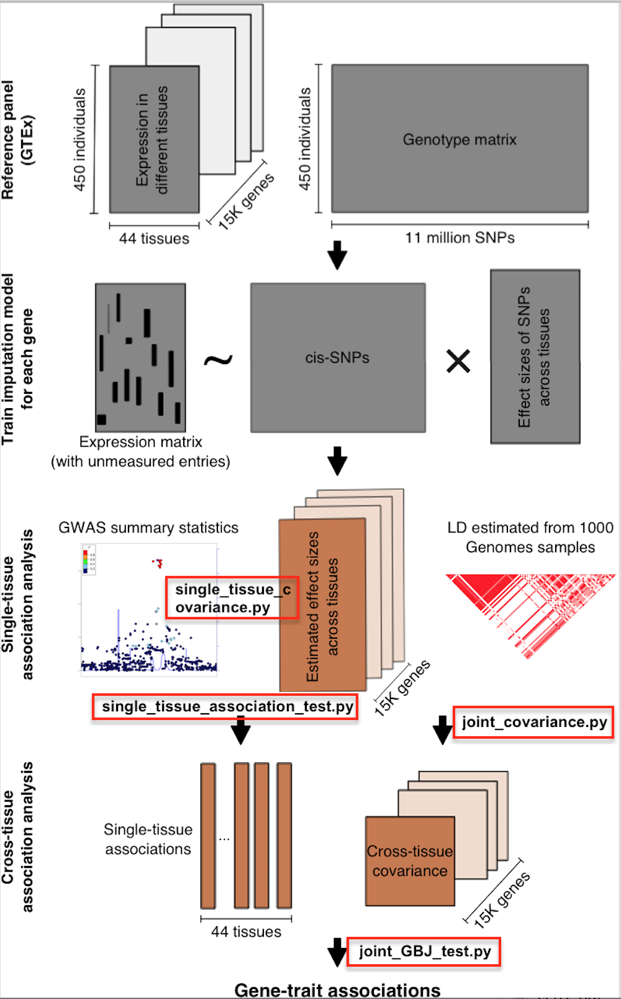

# [Update]--2023/06/09--for weights trained with GTEx v8, please visit https://zhaocenter.org/UTMOST.

**[Update]--2018/04/24--pre-calculated covariance matrices for single-tissue and joint tests are downloadable now; updated pipeline for single-tissue/joint tests using 44 GTEx tissues + STARNET liver + BLUEPRINT 3 cell types (eQTL/sQTL).**

**[Acknowledgement]

Many thanks to Chi Zhang, Tianyu Liu, Chen Lin, Yiming Shi from Zhao Lab for maintaining the packages and files.

# UTMOST

UTMOST (Unified Test for MOlecular SignaTures) is a principled method to perform cross-tissue expression imputation and gene-level association analysis. The preprint could be found at [A statistical framework for cross-tissue transcriptome-wide association analysis](https://www.biorxiv.org/content/early/2018/03/21/286013).

## Prerequisites

The software is developed and tested in Linux and Mac OS environments. 

* Python 2.7 

* numpy (>=1.11.1)

* scipy (>=0.18.1)

* pandas (>=0.18.1)

* rpy2 (==2.8.6)

* R is needed for GBJ testing.

* GBJ ([0.5.0](https://cran.r-project.org/web/packages/GBJ/index.html))

```bash
## Install python module with pip
$ pip install numpy --user
$ pip install scipy --user
$ pip install pandas --user
$ pip install -Iv rpy2==2.8.6 --user

## GBJ could be installed with R interface
install.packages('GBJ')
```

## Project Layout
* single_tissue_covariance.py

* single_tissue_association_test.py

* joint_covariance.py

* joint_GBJ_test.py

* test_tool

* metax module


                        
The following example assumes that you have **python 2.7**, **numpy**, **pandas**, **scipy**, **rpy2**, **R** and **GBJ** installed. 
All of these functions take different number of command line parameters. Run them with --help or -h option to see the options. **Codes for training cross-tissue gene-expression imputation models were curated in a separate [repo](https://github.com/yiminghu/CTIMP)**.

## Quick start
**This section is a demonstration of applying UTMOST with imputation models jointly trained in 44 tissues with GTEx data. The sample_data.zip contains pre-calculated imputation models, covariance matrices for single tissue and joint tissue GBJ test. Pipeline for generating covariance matrices with your own imputation models and incorporating other eQTL/sQTL data (e.g. from [STARNET](https://github.com/Wainberg/Vulnerabilities_of_TWAS) and BLUEPRINT (ftp://ftp.ebi.ac.uk/pub/databases/blueprint/blueprint_Epivar/qtl_as/)), i.e. the analysis pipeline used in manuscript) could be found in the following section.**

**1. Clone the UTMOST repository**
```bash
$ git clone https://github.com/Joker-Jerome/UTMOST
```

**2. Go to the software directory**
```bash
$ cd ./UTMOST
```
**3.1 Download imputation model (weights) data (1.9GB for zipped file, 3.4GB after unzipping)**
```bash
$ wget --load-cookies /tmp/cookies.txt "https://drive.google.com/uc?export=download&confirm=$(wget --quiet --save-cookies  /tmp/cookies.txt --keep-session-cookies --no-check-certificate 'https://drive.google.com/uc?export=download&id=1u8CRwb6rZ-gSPl89qm3tKpJArUT8XrEe' -O- | sed -rn 's/.*confirm=([0-9A-Za-z_]+).*/\1\n/p')&id=1u8CRwb6rZ-gSPl89qm3tKpJArUT8XrEe" -O sample_data.zip && rm -rf /tmp/cookies.txt
$ unzip sample_data.zip
```

This folder will include the following files/folders:
```bash
weight_db_GTEx/ ## jointly trained imputation models for 44 GTEx tissues 
weight_db_external/ ## imputation models for STARNET liver tissue and BLUEPRINT 3 cell-type eQTL/sQTL data
dosage/ ## a reference genotype panel for calculating covariance matrices
GWAS/ ## a simulated GWAS summary stats file as an example
covariance.txt.gz and DGN-WB_0.5.db ## toy example for demonstrating single-tissue test
```
To run single-tissue and joint GBJ test with these imputation models, you need to either generate covariance matrices with a reference genotype panel (for details see **Methods** section in manuscript) or you could download the **pre-calculated covariance matrices** for 44 GTEx tissues. Instructions on how to calculate covariance matrices could be found in **Section 5** in this tutorial.

**3.2 Download pre-calculate covariance matrices for single-tissue/joint test (large file 28GB for zipped file, 45GB after unzipping)**
* **[Update]--2023/06/09--for weights trained with GTEx v8, please visit https://zhaocenter.org/UTMOST.**
```bash
$ cd sample_data
$ wget --load-cookies /tmp/cookies.txt "https://drive.google.com/uc?export=download&confirm=$(wget --quiet --save-cookies  /tmp/cookies.txt --keep-session-cookies --no-check-certificate 'https://drive.google.com/uc?export=download&id=1Kh3lHyTioKIXqCsREmsAyC-dS49KVO9G' -O- | sed -rn 's/.*confirm=([0-9A-Za-z_]+).*/\1\n/p')&id=1Kh3lHyTioKIXqCsREmsAyC-dS49KVO9G" -O covariance_tissue.tar.gz && rm -rf /tmp/cookies.txt
$ wget --load-cookies /tmp/cookies.txt "https://drive.google.com/uc?export=download&confirm=$(wget --quiet --save-cookies  /tmp/cookies.txt --keep-session-cookies --no-check-certificate 'https://drive.google.com/uc?export=download&id=1tqIW5Ms8p1StX7WXXWVa4TGKb5q58TPA' -O- | sed -rn 's/.*confirm=([0-9A-Za-z_]+).*/\1\n/p')&id=1tqIW5Ms8p1StX7WXXWVa4TGKb5q58TPA" -O covariance_joint.zip && rm -rf /tmp/cookies.txt
$ tar -zxvf covariance_tissue.tar.gz
$ unzip covariance_joint.zip

```
**covariance_tissue/** and **covariance_joint/** contain covariance matrices required for single-tissue and joint gene-trait association tests, respectively.

**3.3 Download example GWAS summary statistics [GIANT GWAS Anthropometric 2015 BMI data](https://portals.broadinstitute.org/collaboration/giant/index.php/GIANT_consortium_data_files)**
```bash
cd GWAS
wget https://portals.broadinstitute.org/collaboration/giant/images/1/15/SNP_gwas_mc_merge_nogc.tbl.uniq.gz
gunzip SNP_gwas_mc_merge_nogc.tbl.uniq.gz
```

**4. Run UTMOST with cross-tissue imputation models trained in 44 GTEx tissues**

**4.1. Run single tissue association test for 44 tissues**
```bash
cd ../.. ## at UTMOST/
mkdir sample_data/results
TISSUE_GTEx=(Adipose_Subcutaneous Adipose_Visceral_Omentum Adrenal_Gland Artery_Aorta Artery_Coronary Artery_Tibial Brain_Anterior_cingulate_cortex_BA24 Brain_Caudate_basal_ganglia Brain_Cerebellar_Hemisphere Brain_Cerebellum Brain_Cortex Brain_Frontal_Cortex_BA9 Brain_Hippocampus Brain_Hypothalamus Brain_Nucleus_accumbens_basal_ganglia Brain_Putamen_basal_ganglia Breast_Mammary_Tissue Cells_EBV-transformed_lymphocytes Cells_Transformed_fibroblasts Colon_Sigmoid Colon_Transverse Esophagus_Gastroesophageal_Junction Esophagus_Mucosa Esophagus_Muscularis Heart_Atrial_Appendage Heart_Left_Ventricle Liver Lung Muscle_Skeletal Nerve_Tibial Ovary Pancreas Pituitary Prostate Skin_Not_Sun_Exposed_Suprapubic Skin_Sun_Exposed_Lower_leg Small_Intestine_Terminal_Ileum Spleen Stomach Testis Thyroid Uterus Vagina Whole_Blood)
for tissue in ${TISSUE_GTEx[@]}
do
python2 ./single_tissue_association_test.py \
--model_db_path sample_data/weight_db_GTEx/${tissue}.db \
--covariance sample_data/covariance_tissue/${tissue}.txt.gz \
--gwas_folder sample_data/GWAS \
--gwas_file_pattern SNP_gwas_mc_merge_nogc.tbl.uniq \
--snp_column SNP \
--effect_allele_column A1 \
--non_effect_allele_column A2 \
--beta_column b \
--pvalue_column p \
--output_file sample_data/results/${tissue}.csv
done
```
The example command parameters:

* *--model_db_path* 

  Path to gene expression imputation model (estimated weights/effect sizes of cis-eQTLs).
  
* *--covariance* 

  Path to file containing covariance information (used to estimate the variance of gene-level effect size estimator, see **Gene-level association test** in **Methods** section of manuscript for details).
  
* *--gwas_folder* 

  Folder containing GWAS summary statistics data.
  
* *--gwas_file_pattern* 

  The file patten of gwas file (file name of summary statistics if not segmented by chromosomes).
  
* *--snp_column* 

  Argument with the name of the column containing the RSIDs.
  
* *--effect_allele_column* 

  Argument with the name of the column containing the effect allele.
  
* *--non_effect_allele_column* 

  Argument with the name of the column containing the non-effect allele.
  
* *--beta_column* 

  The column containing -effect size estimator for each SNP- in the input GWAS files.
  
* *--pvalue_column* 

  The column containing -PValue for each SNP- in the input GWAS files.
  
* *--output_file* 

  Path where results will be saved to.

**4.2. Combine gene-trait associations in 44 tissues by joint GBJ test**
```bash
mkdir sample_data/results_GTEx ## save association results for cross-tissue joint test
UTMOST_path=/absolute/path/to/UTMOST/
$ python2 joint_GBJ_test.py \
--weight_db $UTMOST_path/sample_data/weight_db_GTEx/ \
--output_dir $UTMOST_path/sample_data/results_GTEx/ \
--cov_dir $UTMOST_path/sample_data/covariance_joint/ \
--input_folder $UTMOST_path/sample_data/results/ \
--gene_info $UTMOST_path/intermediate/gene_info.txt \
--output_name GIANT_BMI_2015_GTEx_44_joint \
--start_gene_index 1 \
--end_gene_index 17290
```

The example command parameters:

* *--verbosity* 

  Log verbosity level. 1 means everything will be logged. 10 means high level messages will be logged.
  
* *--weight_db*

  Name of weight db in data folder (imputation models).
  
* *--input_folder*

  Name of folder containing single-tissue association results (generated in **Section 4.1**).
  
* *--cov_dir* 

  Path where covariance results are (covariance matrix for gene-level test statistics across tissues, see **Gene-level association test** in **Methods** section of manuscript for details).
  
* *--output_dir* 

  Path where results will be saved to.
  
* *--gene_info*

  File containing the all the genes tested.
  
* *--start_gene_index*

  Index of the starting gene in intermediate/gene_info.txt (for parallel computing purpose, could test multiple gene at the same time to reduce computation time).
  
* *--end_gene_index*

  Index of the ending gene in intermediate/gene_info.txt (for parallel computing purpose, could test multiple gene at the same time to reduce computation time).

Output format:

  | Gene        | Test score     | P value  |
  | ------------- |:-------------:| -----:|
  |      Gene A    | test score A               |  P value A        |
  |      Gene B    | test score B               |  P value B        |

## Incorporating external eQTL/sQTL datasets
**Using [STARNET](https://github.com/Wainberg/Vulnerabilities_of_TWAS) and BLUEPRINT (ftp://ftp.ebi.ac.uk/pub/databases/blueprint/blueprint_Epivar/qtl_as/) as an example, for details, please see Results and Methods sections of manuscript**

**Note: this part also requires data in sample_data folder**

**5.1. Calculate the single tissue covariance**
```bash
TISSUE_external=(Liver_STARNET1 mono_eqtl mono_sqtl neut_eqtl neut_sqtl tcel_eqtl tcel_sqtl)
mkdir sample_data/covariance_external
for tissue in ${TISSUE_external[@]}
do
python2 ./single_tissue_covariance.py \
--weight_db sample_data/weight_db_external/${tissue}.db \
--input_folder sample_data/dosage/ \
--covariance_output sample_data/covariance_external/${tissue}.txt.gz
done
```
The example command parameters:

* *--weight_db* 

  Path to tissue transriptome model.
  
* *--input_folder* 

  Folder containing GWAS summary statistics data.
  
* *--covariance_output* 

  Path where covariance will be saved to.


**5.2. Run the single tissue association test**
```bash
for tissue in ${TISSUE_external[@]}
do
python2 ./single_tissue_association_test.py \
--model_db_path sample_data/weight_db_external/${tissue}.db \
--covariance sample_data/covariance_external/${tissue}.txt.gz \
--gwas_folder sample_data/GWAS \
--gwas_file_pattern SNP_gwas_mc_merge_nogc.tbl.uniq \
--snp_column SNP \
--effect_allele_column A1 \
--non_effect_allele_column A2 \
--beta_column b \
--pvalue_column p \
--output_file sample_data/results/${tissue}.csv
done
```

**5.3. Calculate the joint tissue covariance**
```bash
mkdir covariance_GTEx_external ## path for saving new covariance matrix (could take ~25GB space)
mkdir sample_data/weight_db_GTEx_external ## path for saving imputation models across different tissues
cp sample_data/weight_db_GTEx/* sample_data/weight_db_GTEx_external/
cp sample_data/weight_db_external/* sample_data/weight_db_GTEx_external/
python2 ./joint_covariance.py \
--weight_db sample_data/weight_db_GTEx_external/ \
--input_folder sample_data/dosage/ \
--covariance_output sample_data/covariance_GTEx_external/
```
The example command parameters:

* *--verbosity* 
  
  Log verbosity level. 1 means everything will be logged. 10 means high level messages will be logged.
  
* *--weight_db*

  Name of weight db in data folder.
  
* *--input_folder*

  Name of folder containing dosage data.
  
* *--covariance_output* 

  Path where covariance results will be saved to.
  
* *--min_maf_filter*

  Filter SNPs according to this maf.
  
* *--max_maf_filter*

  Filter SNPs according to this maf.

**5.4. Combine gene-trait associations in 44 tissues + STARNET liver eQTL + BLUEPRINT eQTL/sQTL by joint GBJ test**
```bash
## note after 5.2, sample_data/results/ now contains 44 + 1 + 3*2 single-tissue association results
UTMOST_path=/absolute/path/to/UTMOST/
$ mkdir results_GTEx_external
$ python2 joint_GBJ_test.py \
--weight_db $UTMOST_path/sample_data/weight_db_GTEx_external/ \
--output_dir $UTMOST_path/results_GTEx_external/ \
--cov_dir $UTMOST_path/covariance_GTEx_external/ \
--input_folder $UTMOST_path/sample_data/results/ \
--gene_info $UTMOST_path/intermediate/gene_info.txt \
--output_name test_GTEx_external
```
**Conditional Analysis**
```bash
python2 conditional_test_geneset.py \
--utmost_dir $UTMOST_path \
--weight_db $UTMOST_path/sample_data/weight_db_GTEx/ \
--input_folder $UTMOST_path/sample_data/dosage/ \
--gwas_str gwas \
--gwas_folder /GWAS_data/ \
--gwas_file_pattern GWAS.txt \
--snp_column SNP \
--effect_allele_column A1 \
--non_effect_allele_column A2 \
--beta_column BETA \
--se_column SE \
--pvalue_column P \
--chr_idx 1 \
--gene_list  Gene1,Gene2,Gene3 \
--output_dir /output_dir/
```

The example command parameters:
* *--utmost_dir* 

  Path to UTMOST.
  
* *--weight_db* 

  Path to gene expression imputation model (estimated weights/effect sizes of cis-eQTLs).
  
* *--input_folder*

  Name of folder containing dosage data.
  
* *--gwas_str*

  GWAS name string.
  
* *--gwas_folder* 

  Folder containing GWAS summary statistics data.
  
* *--gwas_file_pattern* 

  The file patten of gwas file (file name of summary statistics if not segmented by chromosomes).
  
* *--snp_column* 

  Argument with the name of the column containing the RSIDs.
  
* *--effect_allele_column* 

  Argument with the name of the column containing the effect allele.
  
* *--non_effect_allele_column* 

  Argument with the name of the column containing the non-effect allele.
  
* *--beta_column* 

  The column containing -effect size estimator for each SNP- in the input GWAS files.
  
* *--se_column*
  
  The column containing the standard error for effect size estimate. 
  
* *--pvalue_column* 

  The column containing -PValue for each SNP- in the input GWAS files.
  
* *--chr_idx* 

  Chromosome number.

* *--gene_list* 

  Genes to be tested.
  
* *--output_dir* 

  Path where results will be saved to.
  
## Acknowledgement
Part of the code is modified from MetaXcan https://github.com/hakyimlab/MetaXcan. We thank the authors for sharing the code.

## Reference
**Hu et al. (2018). A statistical framework for cross-tissue transcriptome-wide association analysis. bioRxiv, 286013.**
[Link](https://www.biorxiv.org/content/early/2018/03/21/286013)
